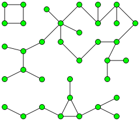

# Graphx内置算法说明

[TOC]

本章介绍综述中提到的三种算法，我们将从如下几个方面介绍：

基本原理，算法输入、输出和算法应用。

## 1 connected component

在图论中，无向图中的连通分量是指在子图中，任意两个点都被一条通路相连，并且**不与**母图中的任意一个点相连。

如上图所示，图中有三个连通分量。一个没有被任何其他边相连的点，本身就是一个连通分量。一张图中如果每一个点都被其他点相连，那么整个图就是一个连通分量。

#### 1.1 算法原理

计算一张图中的所有的连通分量子图，我们可以从任意点开始，遍历这个点和它相连的所有点，以及这些相连点所相连的其他点。再从剩下的未被相连的点中，选取任意点按如上方法进行遍历，知道遍历完图中的所有点。因此，连通分量算法的时间复杂度为$O(V)+O(E)$,其中$V$代表点的数量，$E$代表边的数量。

#### 1.2 算法输入、输出

**对于一般的connected component算法输入如下：**

边的集合，包括每条边的$src\_id$和$dst\_id$；

点的集合，包括点的$id$;

**算法输出如下：**

点的id及其对应的连通分量子图序号。

#### 1.3 算法应用

待补充。

## 2 参考资料

连通分量(Connected Component)的原理

https://en.wikipedia.org/wiki/Connected_component_(graph_theory)