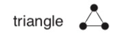
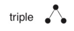
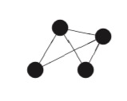

# Triangle-counting

[TOC]

本章介绍综述中提到的三种算法，我们将从如下几个方面介绍：

基本原理，算法输入、输出和算法应用。

## 1 triangle counting

如果我们把任意图 $ G $ 看做一个无向图，当一个点$V$有两个相邻有边连接的点，且两个点也互相相连时，这个点$V$是一个三角形的一部分。GraphX采用三角形计算算法来计算一个点存在于多少个三角形当中，并将最后的结果汇总，构成一个聚类分群算法。

#### 1.1 算法原理

##### 1.1.1 聚类系数（Clustering Coefficient）

首先，三角形计算是一种聚类算法。我们的目的实际上是计算图中的哪些点可以构成子图，且任一点只存在于一个子图中。而构成子图的条件则是：构成子图的点所组成的子图，使该子图的**聚类系数（Cluster Coefficient）**最大。因此，我们将聚类算法三角形计算，转化为一个求任意点组成的子图的聚类系数问题。

我们用$G(V,E)$表示图，其中$|V| = n$表示图中有$n$个点，$|E| = m$表示图中有$m$个边。聚类系数表征以下两层含义：

**“一个人朋友的朋友，同样也是这个人的朋友”**

**“该系数也是衡量一个人造的图是否能反应真实世界情况的一个重要特征”**

根据图论(Graph Theory)，我们用$CC$表示聚类系数，那么有如下计算公式：

**方法1：**
$$
CC(V_{i}) =  \frac{3 \times number\;of\;triangles \in V }{number\;of\;triples \in V} \tag{3-1}
$$

其中的分子为图 $V_{i}$ 中分子为三倍它的triangle的个数，分母为它的triple个数。形象的表示如下图：

一个图中各有多少个triangle和多少triple的例子如下：

​    

比较容易的得出上图中triangle的个数为2，而triple的个数为8。而**最左边点**的聚类系数的值为$\frac{3 \times 1}6  = 0.5$。

因此求解任意子图聚类系数的问题，现在转化为子图中**triple counting**与**triangle counting**的问题。

**方法2：**
$$
CC(V_{i}) =  \frac{2 \times N_{V_i} }   {K_{V_i} \times (K_{V_i}-1) } \tag{3-2}
$$
其中$N_{V_i}$表示与点$V_{i}$相邻的点中，有多少点是互相相连的；$K_{V_i}$则表示点$V_i$的自由度。对于无向图，任意点的自由度等于与其相连的边的数量，如果该点有一条终点和起点均为自身的边，那么计算自由度的时候此边记为2。

这时，**我们将求解某个点聚类系数的问题转换为求解每个点的$N_{V_i}$和$K_{V_i}$的问题**。同样针对于下图最左边的点：    

​                                                                   

因为该点只有两条边，因此其$K_{V_i}=2$；对于与其相连的两个点，他们是互相相连的，因此$N_{V_i}=1$，根据公式${2}$，我们可以得出该店的聚类系数为$CC(V_{i}) =  \frac{2 \times 1 }   {2 \times (2-1) } = 0.5$。与公式${1}$中得到的结果相同。

 

##### 1.1.2 triple counting

由于没有找到triple counting的资料，因此想了一个比较保守的算法计算任意子图中triple的数量。算法步骤如下：

a. 对于图$G$中任意点$V_i$，遍历与其连接的所有点，组成集合$set_{i1} = \{V_{i1},V_{i2}...V_{ij}\}$;

b. 对于邻点组成的集合$set_i$，遍历其中所有元素相邻的除$V_i$外的点，组成集合$set_{i2} = \{ \{V_{i11},V_{i12}...V_{i1k}\},  \{V_{i21},V_{i22}...V_{i1k}\}... \{V_{ij1},V_{ij2}...V_{i1k}\}\}$，其中，$ i,j,k \in [0,n] $且为整数；

c. 对于从$V_i$开始的triple，其结果集$result = \{ V_iV_{i1}V_{i11},V_{i}V_{i1}V_{i12}....V_{i}V_{ij}V_{ijk}        \}$即为结果集；

d. 采用同样的方法遍历其他所有点，最终得到的结果集取交集，因为$V_{i}V_{ij}V_{ijk}$与$V_{ijk}V_{ij}V_{i}$是完全相同的两个triple。

##### 1.1.3 triangle counting

得到了triple的个数，剩下的工作就是计算图中triangle的个数。在spark.graphx.TriangleCount类中，计算triangle个数的步骤叙述如下：

a. 对于所有点计算与其相邻的边，并记录为集合；

b. 对于每条边，计算其与上面步骤中集合的交集，并将计数结果返回给与该边相连的两个点。

c. 计算每个点的计数结果和，并求和后除以2，因为每个三角形被计数了两次。

**更多关于方法2的详细算法，请见http://theory.stanford.edu/~tim/s14/l/l1.pdf**

#### 1.2 算法输入、输出

**对于一般的triangle counting算法输入如下：**

边的集合，包括每条边的$src\_id$和$dst\_id$；

点的集合，包括点的$id$;

**算法输出如下：**

点的id及其对应的子图序号。

#### 1.3 算法应用

首先我们解释为什么社交网络分析师们关心聚类系数：

第一，对于那些聚类系数很高的子图，这就预示着该图中的对象组成了一个“如网一般密集的社群”。如果对象是人的话，说明这个社群中的某个人的朋友们，很多互相也是朋友。这样的社群可能具有高度“信赖”的特征。

第二个原因则是，低值的聚类系数可能象征着“结构洞”——一个与多个不同且不互相连接的社群连接的点。这就使这样的点具有潜在的优势，例如结合两种不同的技能集合从而产生创新，或者至少能将信息从一个社群传递给另一个社群。

## 2 参考资料

点的自由度（degree of vertex）

https://reference.wolfram.com/language/ref/VertexDegree.html

三角形计算(Triangle Counting)的原理

http://theory.stanford.edu/~tim/s14/l/l1.pdf

https://www.csie.ntu.edu.tw/~b91089/slides/thesis08-present.pdf
